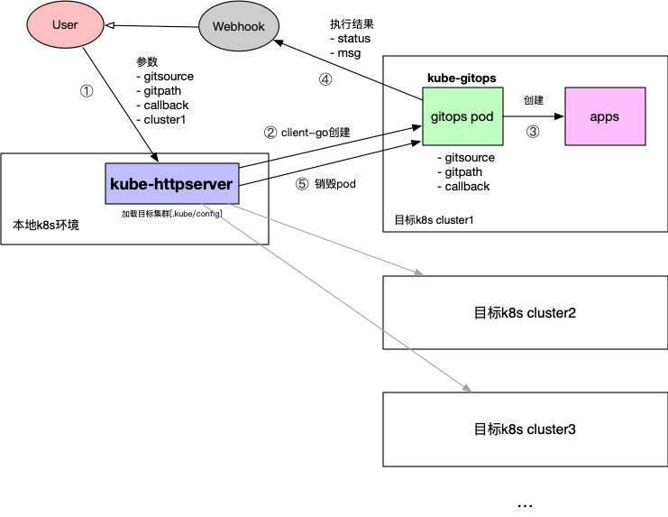

# kube-httpserver

使用HTTP Server API 接口创建部署指定GitSource的应用

#### 工作流程



- Kube-httpserver：接收用户的git仓库来源的部署需求，来源文件为k8s部署yaml文件
- [Kube-gitops](http://git.harmonycloud.cn/gitops/kube-gitops.git)：负责创建用户发来的yaml文件对应的部署项目，gitops pod由Kube-httpserver连接上目标集群后在目标集群创建


#### 部署步骤

##### 使用[ko](https://github.com/google/ko)一键部署(推荐)

提前安装ko

```shell
go install github.com/google/ko@latest
```

1. 应用 kube-httpserver

   ```shell
   #设置镜像仓库地址，ko会把制作好的镜像push该仓库。
   export KO_DOCKER_REPO=docker.io/asialeaf
   #部署
   ko apply -Rf config/kube-httpserver.yaml
   ```

   kube-httpserver.yaml
   ```yaml
   apiVersion: apps/v1
   kind: Deployment
   metadata:
     name: kube-httpserver
     namespace: default
     labels:
       app.kubernetes.io/version: devel
       app.kubernetes.io/name: kube-httpserver
   spec:
     selector:
       matchLabels: &labels
         app: kube-httpserver
     template:
       metadata:
         labels:
           <<: *labels
           app.kubernetes.io/version: devel
           app.kubernetes.io/name: kube-httpserver
       spec:
         hostAliases:              #apiserver 主机域名解析
         - ip : "192.168.50.225"
           hostnames:
           - "cluster-endpoint"
         containers:
         - name: kube-httpserver
           image: ko://git.harmonycloud.cn/gitops/kube-httpserver/cmd/kube-httpserver
           imagePullPolicy: IfNotPresent
           ports:
           - name: http
             containerPort: 8080
             protocol : TCP
           resources:
             limits:
               cpu: 2
               memory: 500Mi      
             requests:
               cpu: 1
               memory: 400Mi    
           volumeMounts:
           - mountPath: /root/.kube
             name: kubeconfig
             readOnly: true
         restartPolicy: Always
         nodeSelector: 
           kubernetes.io/hostname: k8s-master   #如需部署到其他节点需修改
         tolerations:
         - effect: NoSchedule
           operator: Exists
         volumes:
         - hostPath:
             path: /root/.kube           #使用本地集群config
             type: DirectoryOrCreate
           name: kubeconfig
   
   ---
   
   apiVersion: v1
   kind: Service
   metadata:
     labels:
       app.kubernetes.io/version: devel
       app.kubernetes.io/name: kube-httpserver
     name: kube-httpserver
     namespace: default
   spec:
     ports:
       - name: http
         port: 8080
         targetPort: 8080
     selector:
       app: kube-httpserver
     type: NodePort
   
   ```


2. 检查日志输出

   ```shell
   kubectl logs -f kube-httpserver-bbb798857-ggdjg
   ```

   

   ```shell
   [root@k8s-master kube-httpserver]# kubectl logs -f kube-httpserver-bbb798857-ggdjg
   gitops httpserver ...
   [GIN-debug] [WARNING] Creating an Engine instance with the Logger and Recovery middleware already attached.
   
   [GIN-debug] [WARNING] Running in "debug" mode. Switch to "release" mode in production.
    - using env:	export GIN_MODE=release
    - using code:	gin.SetMode(gin.ReleaseMode)
   
   [GIN-debug] POST   /gitops/deploy            --> git.harmonycloud.cn/yeyazhou/kube-httpserver/pkg/server.Demo.func1 (3 handlers)
   [GIN-debug] [WARNING] You trusted all proxies, this is NOT safe. We recommend you to set a value.
   Please check https://pkg.go.dev/github.com/gin-gonic/gin#readme-don-t-trust-all-proxies for details.
   [GIN-debug] Listening and serving HTTP on :8080
   ```

   
   
##### 使用Dockerfile部署

1. 构建镜像并上传至镜像仓库

   ```shell
   docker build -t local.harbor.io/kube-httpserver:v1.0 .
   docker push local.harbor.io/kube-httpserver:v1.0
   ```

2. 修改deployment.yaml内镜像地址

   ```shell
   vim deploy/kube-httpserver.yaml
   ```

   ```yaml
   apiVersion: apps/v1
   kind: Deployment
   metadata:
     name: kube-httpserver
     namespace: default
     labels:
       app.kubernetes.io/version: devel
       app.kubernetes.io/name: kube-httpserver
   spec:
     selector:
       matchLabels:
         app: kube-httpserver
         app.kubernetes.io/version: devel
         app.kubernetes.io/name: kube-httpserver
     template:
       metadata:
         labels:
           app: kube-httpserver
           app.kubernetes.io/version: devel
           app.kubernetes.io/name: kube-httpserver
       spec:
         hostAliases:
         - ip : "192.168.50.225"     #apiserver 主机域名解析
           hostnames:
           - "cluster-endpoint"
         containers:
         - name: kube-httpserver
           image: local.harbor.io/kube-httpserver:v1.0      #修改为实际镜像仓库地址
           imagePullPolicy: IfNotPresent
           ports:
           - name: http
             containerPort: 8080
             protocol : TCP
           resources:
             limits:
               cpu: 2
               memory: 500Mi      
             requests:
               cpu: 1
               memory: 400Mi    
           volumeMounts:
           - mountPath: /root/.kube
             name: kubeconfig
             readOnly: true
         restartPolicy: Always
         nodeSelector: 
           kubernetes.io/hostname: k8s-master       #如需部署到其他节点需修改
         tolerations:
         - effect: NoSchedule
           operator: Exists
         volumes:
         - hostPath:
             path: /root/.kube        #使用本地集群config
             type: DirectoryOrCreate
           name: kubeconfig
   
   ---
   
   apiVersion: v1
   kind: Service
   metadata:
     labels:
       app.kubernetes.io/version: devel
       app.kubernetes.io/name: kube-httpserver
     name: kube-httpserver
     namespace: default
   spec:
     ports:
       - name: http
         port: 8080
         targetPort: 8080
     selector:
       app: kube-httpserver
     type: NodePort
   
   ```

3. 创建部署

   ```
   kubectl apply -f deploy/kube-httpserver.yaml
   ```


#### Demo

1. 获取Service

   ```shell
   kubectl get svc kube-httpserve
   ```

   ```shell
   NAME              TYPE       CLUSTER-IP      EXTERNAL-IP   PORT(S)          AGE
   kube-httpserver   NodePort   10.96.231.106   <none>        8080:31290/TCP   115s
   ```

2. 访问HTTP Server

   路径：/gitops/deploy

   POST

   参数：

   | 参数        | 描述                                                         | 是否必选 |
   | ----------- | ------------------------------------------------------------ | -------- |
   | gitsource   | Git仓库地址                                                  | 是       |
   | gitpath     | 部署存放路径                                                 | 是       |
   | callback    | 回调地址，用于返回执行结果                                   | 是       |
   | clustername | 集群名称，默认使用本机集群测试（本地集群的$HOME/.kube/config挂载至容器），如需修改其他集群请挂载其他config测试 | 否       |

   请求Body示例：

   ```json
   {
       "gitsource": "https://github.com/asialeaf/gitops.git",
       "gitpath": "deploy/",
       "callback": "http://10.96.221.127:8060/dingtalk/webhook1/send",
       "clustername": "test"
   }
   ```
   
   返回参数：
   
   ```json
   {
       "status": "success"
   }
   ```
